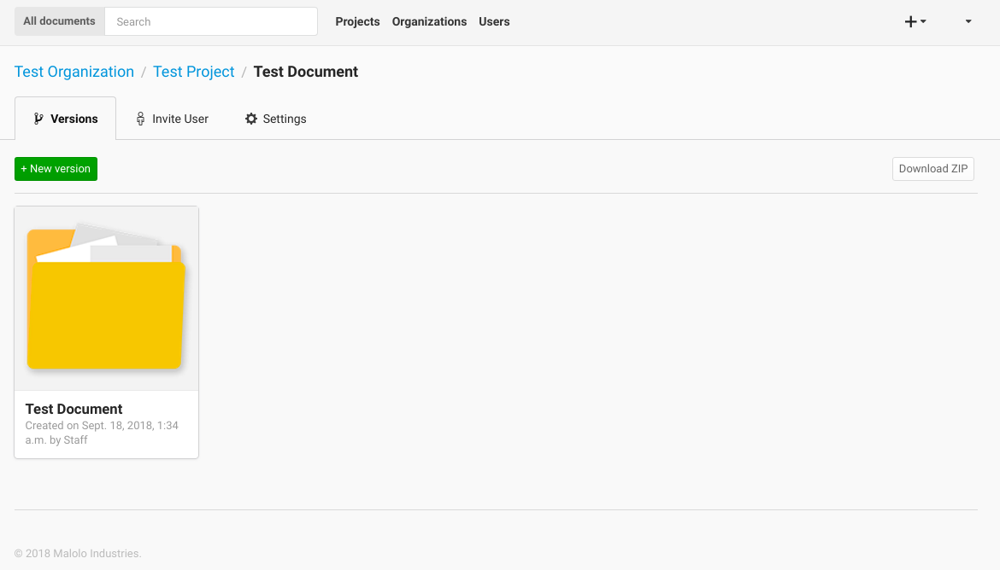
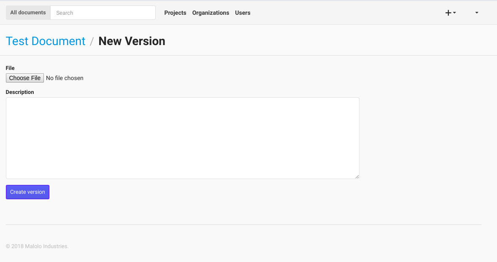
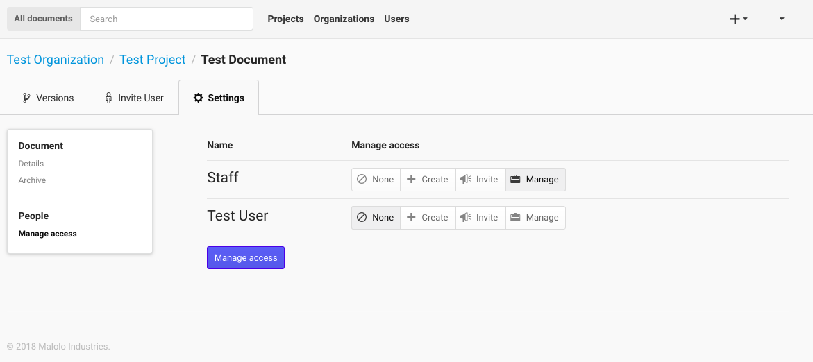

+++++++++++++
Document Page
+++++++++++++

The Document page will show all of the version for the selected Document. You can also request a zipped 
copy of all of the version be sent via email by clicking the **Download ZIP** button.

On the Document page you can **upload** a new version by clicking the **New version** button, choose the file, fill out
the description, click upload.

Managers can also **maange access** for the Document by clicking on the "Manage acess" link in the navigation bar of the settings page.

