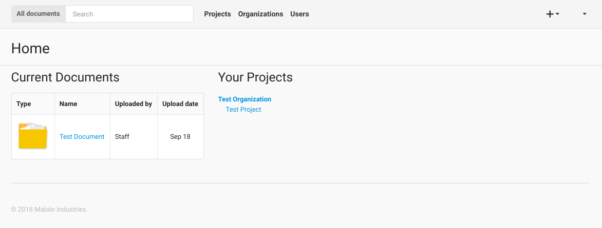

----
Home
----

Once logged in the user will be presented with the "Home Page". From this page the user will see a list of all of the
documents that they have worked on recently. In the middle of the page there is a list of projects that the user has 
access too.

From the Home Page, one can click on any of the links in the **navigation bar**. To access **Projects** and the
associated resources, click on the Projects button.

To get **information about Users** that you are working, such as email or phone number you can click on the Users
button. The Users section of the application is also where and administrator can create and manage Users, more
on this below.

You can also use the search box in the top navigation bar to search for documents based on the document name,
the author, and the description text of the document. Using the search box at this level will search over all of the
documents that you have permissions to view.

In addition to the search box, there is also the "Add Resources" button in the top right corner (the + button).
If you click this button then you can add Organizations and Projects if you have the correct permissions.