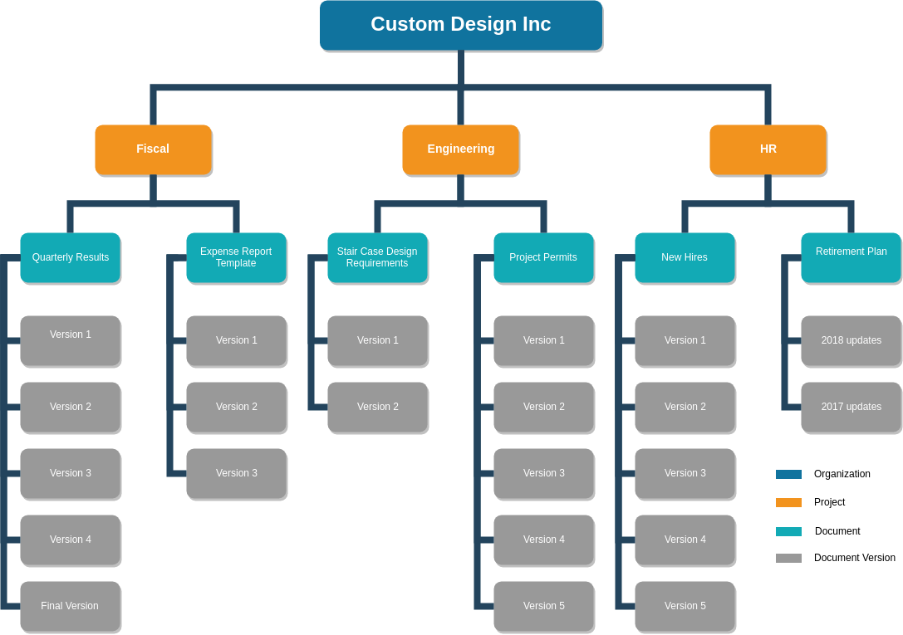

==========
User Guide
==========

Welcome to the Kala documentation. This guide describes the general philosophy
of the application, as well as, detailing the specific operations of each section
of the application.

The main concept of Kala is a hierarchical layout. At the top of the tree is the Organization. For smaller organizations or businesses there might be only one Organization (as shown in the diagram below) but Kala can be configured to have as many Organizations as you wish. For instance, you may want to give each functional unit it’s own Organization, or perhaps a sub contractor should be an Organization within the application. This guide will attempt to provide suggestions on how to divide the application, but it is left to the users and administrators to find the right balance between Organizations and Projects.

Projects always reside within an Organization. Any permissions given to a User at an Organizational level will be propagated through to all of the Projects in that Organization. Likewise all permissions at the Project level will be passed on to all of the Projects Documents.

Documents are a collection of uploaded artifacts to the application. Documents can have associated Users and Permissions of their own. Each Document also has one or more Versions. Each Version has it’s own metadata, such as who was the User that uploaded the Version, comments about the Version and a timestamp of when the Version was uploaded.

This diagram is a visual representation of how a small business might use Kala to organize their documents. In this example, the business has decided that one Organization “Custom Design Inc” is appropriate. In this case one could image that only upper management would have permissions at the Organization level. There are 3 Projects in this Organization, "Fiscal", "Engineering", and "HR". At the Project level it would be appropriate to give Project Managers, Leads, etc. permissions on the respective Project. At the Document level (the most fine grained) you might invite in house team members to work on a specific document, or maybe a 3rd party contractor would be invited to collaborate on a specific Document, by uploading new version for review.

.. toctree::
   :maxdepth: 1
   :caption: Contents:

    Permissions <permissions>
    Home Page & Navigation <home>
    Organizations <organizations>
    Projects <projects>
    Documents & Versions <documents>

