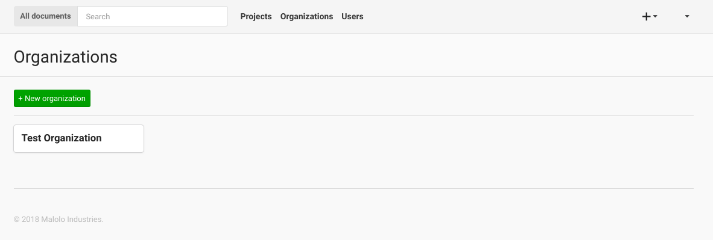
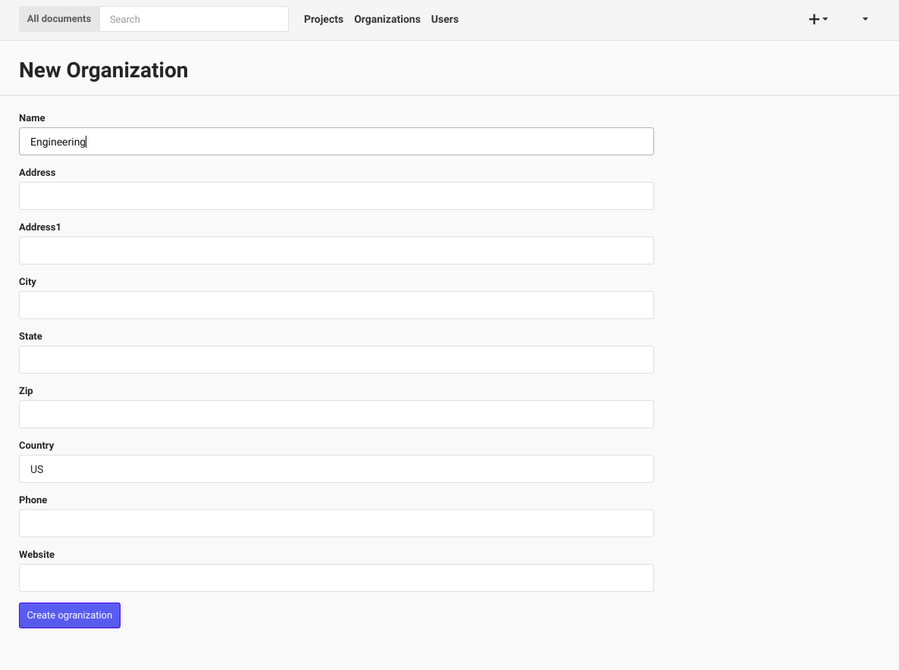
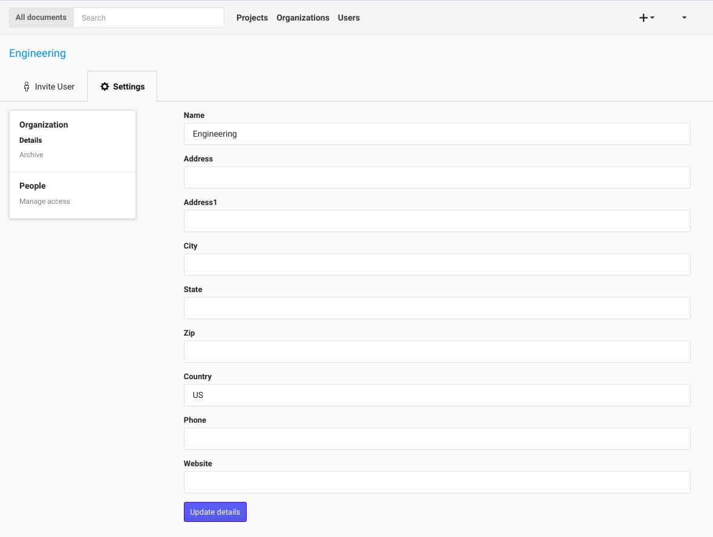
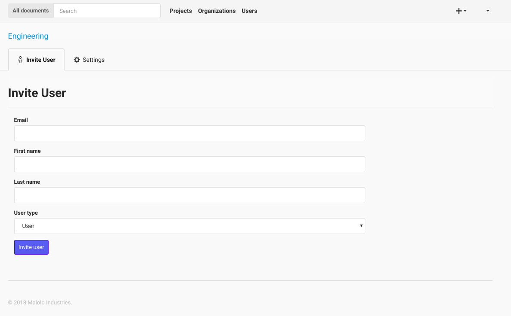

+++++++++++++
Organizations
+++++++++++++

The Organizations page shows a list of all of the Organizations that your user has permissions to view.

-----------------
New Organizations
-----------------

If you are an admin you can click the "+ New Organization" button to create a new Organization. You will need to provide 
at least a name for the new Organization, then you can click the "Create organization" button.

--------
Settings
--------

If you would like to update the Organizations details, or give a User Permission to the Organization, click on the 
name of the Organization on the main page. This will take you to the Organizations settings.

--------------
Inviting Users
--------------

Once you have clicked the Organizations name, you can then Invite Users to the Organization if you have the proper Permissions.
After submitting the form, the User will be sent an email with instructions on how to create a password (if they do not already have one).
Users can be invited to be a manager by selecting the Manager user type in the dropdown.

