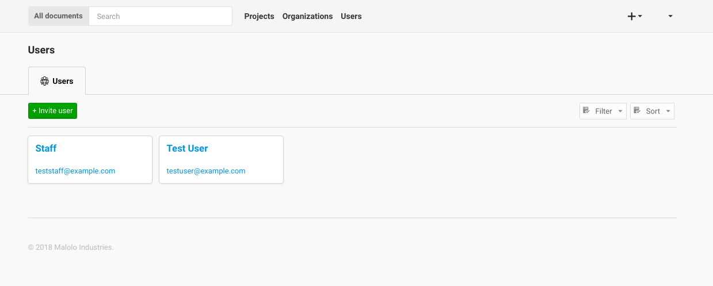
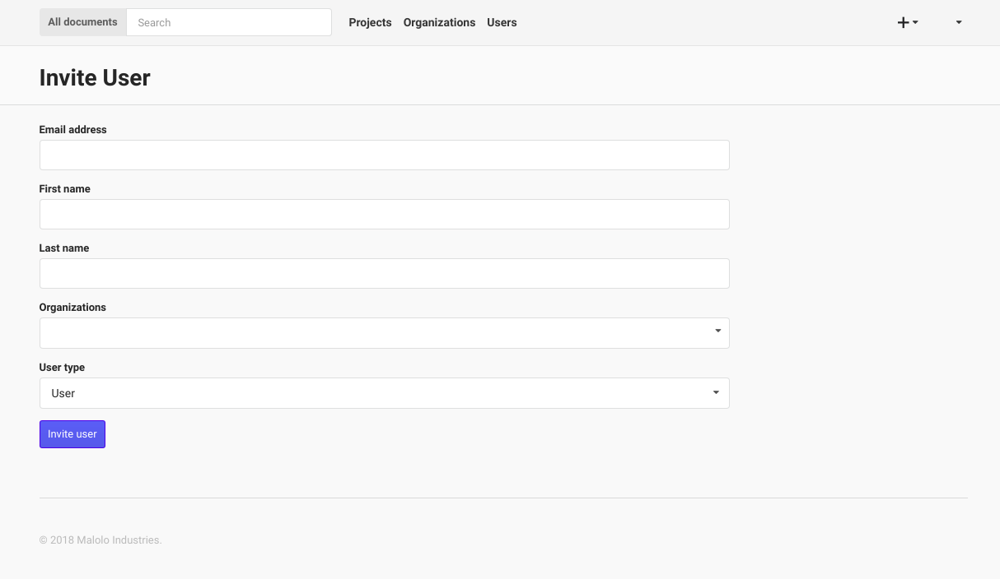
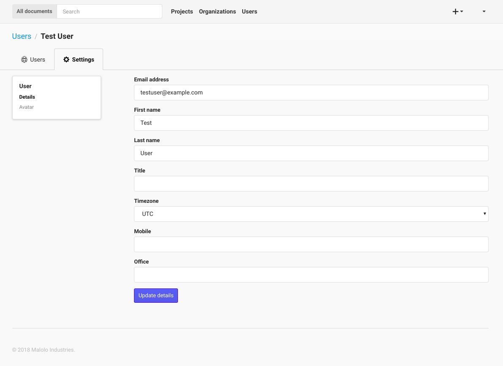

-----------
Permissions
-----------

Every person that requires access to the system must be invited by an administrator or resource owner.
Once the user has an email registered with a password, they can then go the login page, which will be 
the default landing page if the user is not logged in.

+++++
Users
+++++

The Users page allows a user to view all of the Users that they work with. **If you need to know contact information**
this is the page to look in.

If you are an administrator this page also allows you to **Invite Users** by clicking the **Invite users** button, then
filling out the user details. Once the form has been subitted successfully, the new user will be sent an email with 
instructions for creating a password.

The form requires the administrator to fill in the email address, first name, last name, and selecting
a Organization that the User will be in, then by clicking on the "Invite User" button, a new User will be created.
You can then edit the details of the User by clicking the Users name link. **Editing a Person** from
this page will take you to the "User Detials" page, which is described below.

++++++++++++
Edit Profile
++++++++++++

The Edit Profile page is where you can **edit** either your own information or if you are an administrator, you can edit
the information of other Users.

You can also **change your password** or that of others as an administrator from this page, by filling in the password
and confirm text boxes then clicking the "Update Profile" button.

As an administrator you can **delete** a Person here by clicking the "Delete Person", you can also **toggle the
administrative privileges flag** for a Person click clicking the "Grant/Remove Admin" button.

Finally you can grant a Person access to Projects by clicking on the projects tab, then selecting a Organization name from
the accordion list, and selecting/unselecting either a single project or you can grant/remove access to all a Organizations
projects by clicking the "Select/Unselect All" all checkbox. When you are done, click the "Save Permissions" button.

++++++++++++++++++++
Granting Permissions
++++++++++++++++++++

The Edit Permissions page allows an administrator to **grant access** to Users for a given Project. The page will
present the administrator with an accordion list of Organizations. To grant access to Users, click on a Organization name, this
will open the accordion, and display a the list of Users within the Organization. You can then either select/unselect an
individual Person, or you can select/unselect the entire Organization. When you have completed your changes, click on the
"Update Permissions" button at the bottom of the page to save the changes you have made.
