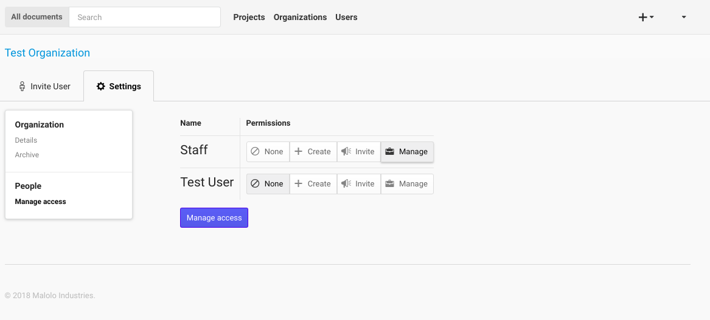
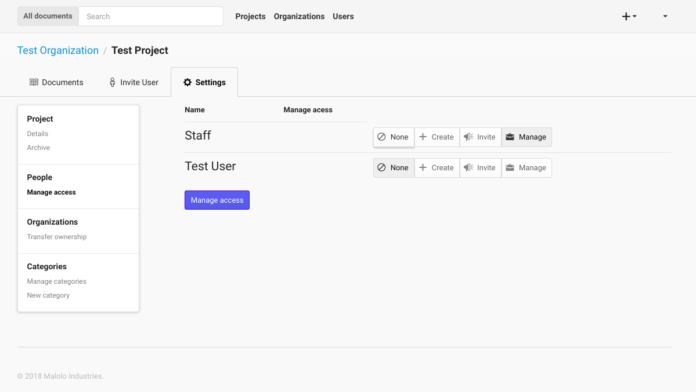
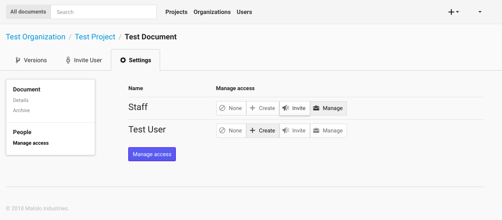
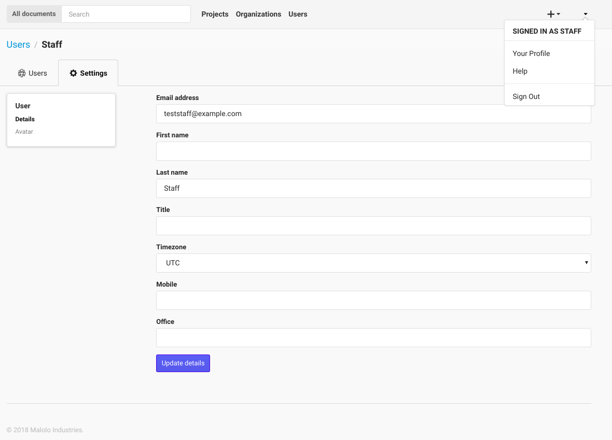

-------------------
Users & Permissions
-------------------

++++++++++++++++++++
Granting Permissions
++++++++++++++++++++

Permissions in Kala follow the nested approach seen in the previous section. The first level of Permission is the “Create” Permission. This allows a User to create resources at the level that they were given Permission at. For example, if a User has been given “Create” Permission for an Organization, then the User will have the ability to create Projects, Documents and Document Versions within that Organization.

The next level of Permissions is the “Invite” Permission. The “Invite” Permission gives the same Permissions as the “Create” Permission, but also allows the User to invite Users to collaborate at the Organizational, Project, or Document Level. If the User only has “Invite” Permission, then they will only be allowed to give invited Users Permission up to the “Invite” level.

Finally, the “Manage” Permission allow a User to be an Administrator for the resource that the User is being assigned to. The “Manage” Permission has both the “Create” and “Invite” Permissions but also allows the User to modify the attributes of the resource, and perform actions such as Archive and Delete.

If a User is given a specific Permission on the Project level, then these Permissions will also be enforced on the Documents of the Project. For example, if a User is given the “Invite” Permission on a Project, then that User will be able to invite Users to all of the Documents contained within the Project. The User will also be able to “Create” new Documents and Document Versions for that Project.

Similar to the example above, if a User is given “Create” Permission on a Document, then that User will be able to create new Document Versions only for the Document that the User has Permissions for. 

+++++
Users
+++++

Every person that requires access to the system must be invited by an administrator or resource owner.
Once the user has an email registered with a password, they can then go the login page, which will be 
the default landing page if the user is not logged in.

.. image:: _imgs/login.png

The Users page allows a user to view all of the Users that they work with. **If you need to know contact information**
this is the page to look in.

.. image:: _imgs/users_page.png

If you are an administrator this page also allows you to **Invite Users** by clicking the **Invite users** button, then
filling out the user details. Once the form has been submitted successfully, the new user will be sent an email with
instructions for creating a password.

.. image:: _imgs/users_form.png

The form requires the administrator to fill in the email address, first name, last name, and selecting
a Organization that the User will be in, then by clicking on the "Invite User" button, a new User will be created.
You can then edit the details of the User by clicking the Users name link. **Editing a Person** from
this page will take you to the "User Details" page, which is described below.

.. image:: _imgs/users_profile.png

++++++++++++
Edit Profile
++++++++++++

Editing your own profile is the same process as editing other users profile (if you are an administrator).
If you click the drop-down in the top right corner of the screen, and click on the "Your Profile" link, you
will be taken to your profile. Change the information that needs to be updated and then click the "Update details"
button.

