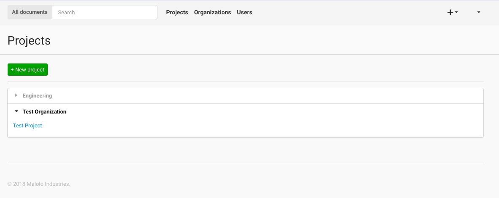
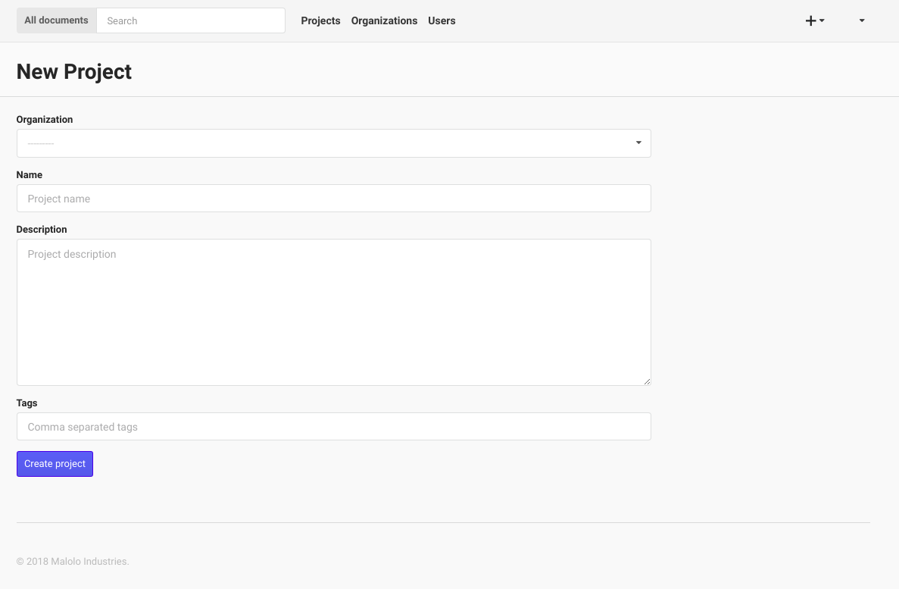
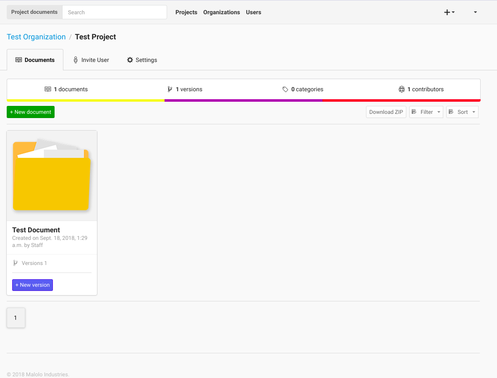
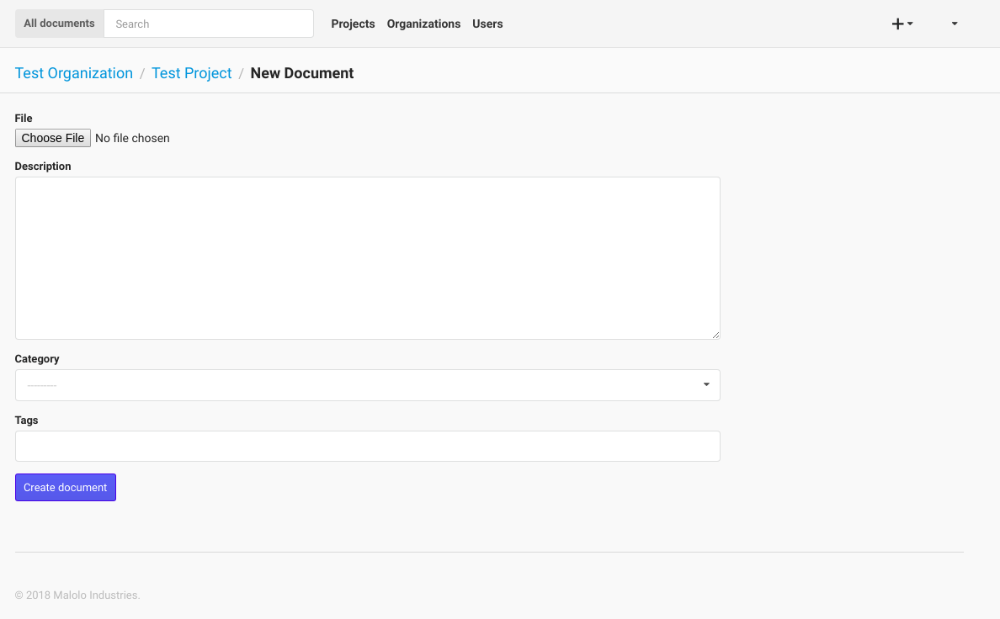
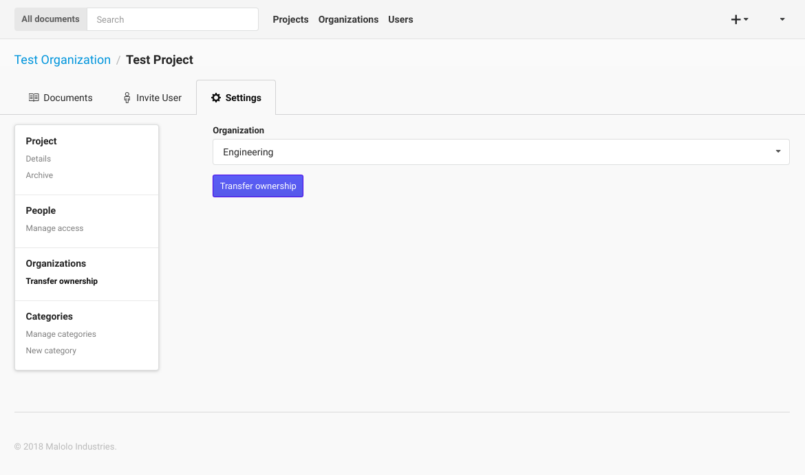
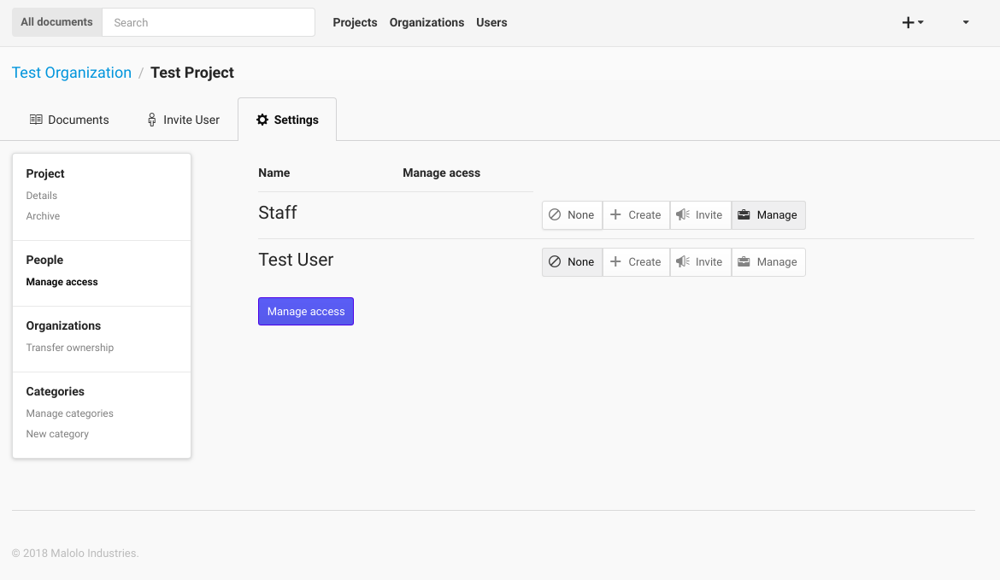

--------
Projects
--------

The Projects page is where you select which project you would like to work with. When you first start on this page you
will be presented with a list of Organizations that you are associated with, and a list of the Projects that you are
working on for the Organizations.

If you are a manager (or administrator) you will also be able to **create** new projects from this page. To create a new Project,
you can enter the name of the new Project and select which Organization you want to create the Project under. 
You must fill out at least the projects name, then click the "Create Project" button and the new Project will be created.

++++++++++++
Project Page
++++++++++++

Once you have selected a Project to work on from the Projects Page, you will be taken to the Project page. This is
where you can interact with the Project's resources. In the Documents tab, you can **upload** a new Document by choosing
the file to upload, the giving the file a description, and optionally add document specific tags. Once you have done
this, you can click the "Upload Document" button to upload the new Document.

You can also **sort** the Documents either by Date - newest to oldest - or you can sort the Documents alphabetically - A
to Z -. You will need to click the "Sort Documents" button to have the sorting take effect. You can also filter the
Documents by the files type. If you only want to see images in click the "Filter by Category" select box, select images
then click "Sort Documents".

To view a Documents detail click the name of the Document.

If you would like to **create a new version** of a Document, you can do that from this page as well. To do this, find
the Document that you would like to upload a new version to, then click the "Add Version" link. Follow the same
instructions for uploading a Document as listed above.

If you are a project manager you can also **move** the Project to another Organization by using the move feature in the
settings section. Click on the "Transfer ownership" and select the Organization that you would like to move the Project to.

Managers can also **manage access** for the Project by clicking on the "Manage access" link in the navigation bar.

